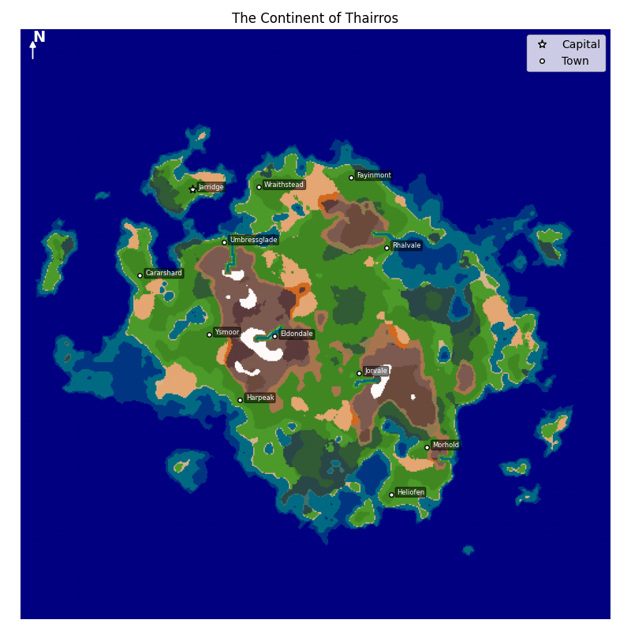

# Continent Procedural Generator
A tool for creating detailed, procedural maps of fantasy continents.
It uses noise-based terrain generation, biome classification, rivers, and artifact removal algorithms to produce natural-looking landscapes complete with towns and geographic features.
## Features
- Heightmap generation using Simplex noise
- Biome classification based on elevation and moisture
- River generation that naturally flows downhill
- Artifact removal to clean up unwanted isolated land or water patches
- Town placement in suitable biome locations
- Map visualization with colour-coded biomes, rivers, and town markers
## In action
The image below is an example output from the generator, a fictional continent named Thairros:

## Installation
This project requires Python 3.x and the following libraries:
- numpy
- matplotlib
- noise
- scipy
- tkinter

Then, run `main.py` to launch the generation UI!
